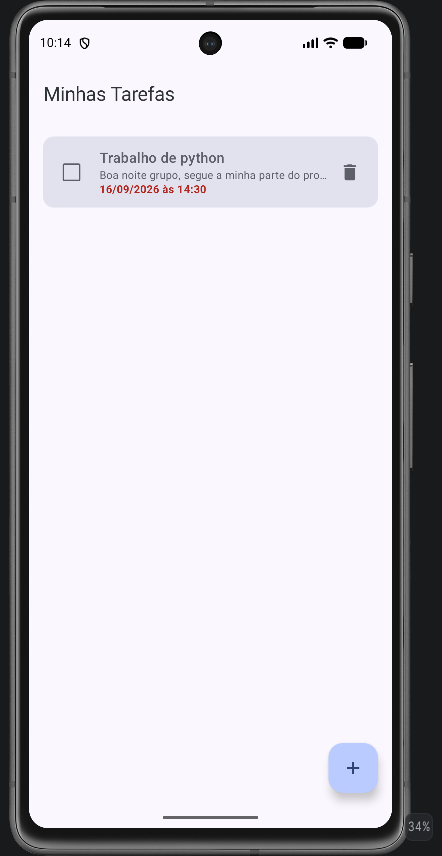
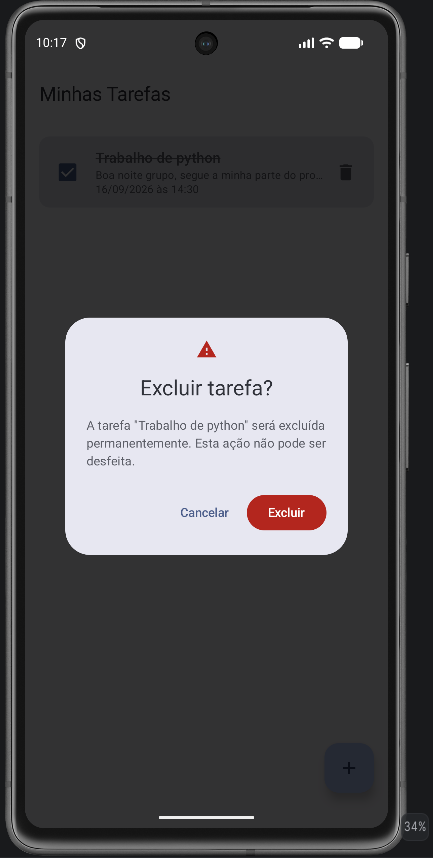
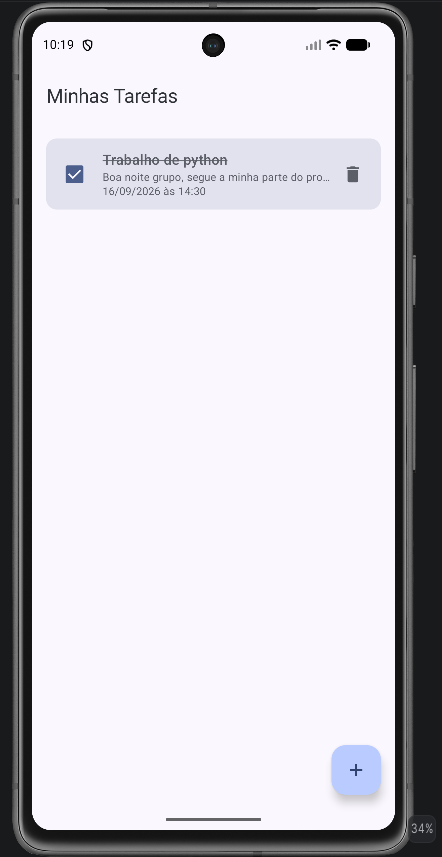
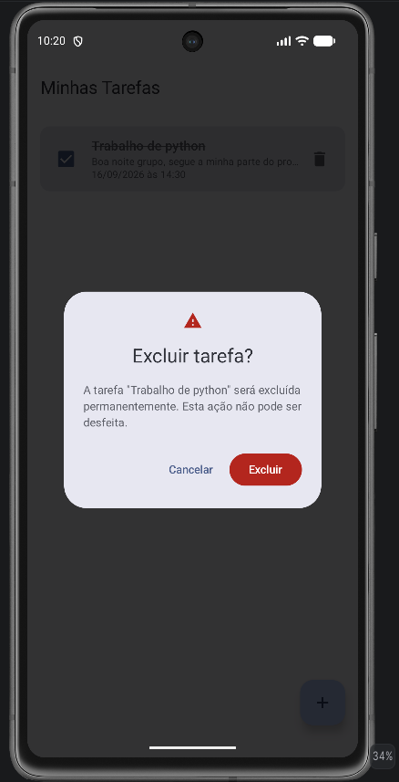
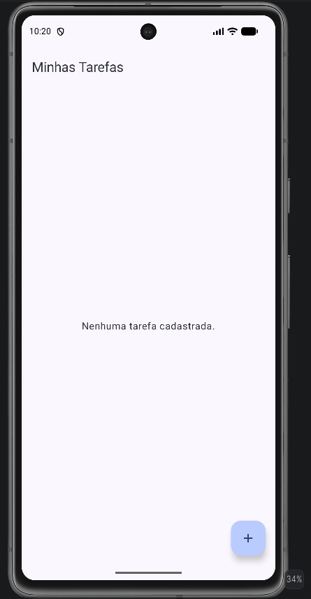

# Evidências — Confirmação de Exclusão de Tarefa

## Descrição do Componente

O fluxo de exclusão de tarefas foi implementado com um **diálogo de confirmação modal**, exibido diretamente sobre a tela da lista, sem navegação para uma nova tela. Ao tocar no ícone de lixeira de qualquer tarefa, o usuário é informado claramente sobre a ação antes que ela seja efetivada.

---

## Tecnologias Utilizadas

| Tecnologia | Uso |
|---|---|
| **Jetpack Compose** | Toda a UI declarativa do aplicativo |
| **Material 3 (`AlertDialog`)** | Componente de diálogo nativo com suporte a ícone, título, corpo e botões de ação |
| **Material 3 (`Button` / `TextButton`)** | Botões de confirmação e cancelamento com estilo semântico |
| **Material Icons** (`Warning`, `Delete`, `Add`) | Ícone de alerta no cabeçalho do diálogo |
| **Compose State** (`mutableStateOf`, `remember`) | Controle do estado `tarefaParaDeletar` dentro da tela |
| **MVVM + ViewModel** | A exclusão é delegada ao `TarefaViewModel.deletar()`, mantendo a lógica fora da UI |
| **Room (via ViewModel)** | Persistência — a tarefa é removida do banco de dados local |

---

## Como Foi Implementado

### Componente `ConfirmarExclusaoDialog`

Foi criado um composable dedicado e reutilizável chamado `ConfirmarExclusaoDialog`, localizado em [`ListaTarefaScreen.kt`](app/src/main/java/GabrielJS2005/com/github/toDoList/ui/ListaTarefaScreen.kt). Ele encapsula toda a lógica visual do diálogo e recebe apenas três parâmetros:

```kotlin
@Composable
fun ConfirmarExclusaoDialog(
    titulo: String,       // título da tarefa a ser excluída
    onConfirmar: () -> Unit,  // chamado ao confirmar — remove a tarefa
    onCancelar: () -> Unit    // chamado ao cancelar — fecha sem alterações
)
```

### Fluxo de Estado na Tela

Na `ListaTarefasScreen`, um estado local `tarefaParaDeletar: Tarefa?` controla qual tarefa está pendente de exclusão:

1. **Ícone de lixeira tocado** → `tarefaParaDeletar = tarefa` (estado atualizado)
2. **`tarefaParaDeletar != null`** → `ConfirmarExclusaoDialog` é exibido sobre a lista
3. **"Cancelar" ou toque fora** → `tarefaParaDeletar = null` (diálogo fechado, lista intacta)
4. **"Excluir" confirmado** → `viewModel.deletar(tarefa)` é chamado, depois `tarefaParaDeletar = null`

Somente a tarefa armazenada em `tarefaParaDeletar` é excluída — nenhuma outra tarefa é afetada.

### Garantias Preservadas

- ✅ Cadastro e edição de tarefas — sem alterações
- ✅ Marcação de conclusão (checkbox) — sem alterações
- ✅ Prazos e indicação de tarefas atrasadas — sem alterações
- ✅ Ordenação da lista — sem alterações
- ✅ Arquitetura MVVM — a UI apenas dispara eventos, o ViewModel executa a lógica

---

## Evidências Visuais

### 1. Lista antes da exclusão

Tela inicial com as tarefas cadastradas. O ícone de lixeira está visível em cada item da lista.



---

### 2. Diálogo aberto com a tarefa selecionada

Ao tocar no ícone de exclusão, o `AlertDialog` é exibido sobre a lista. O título da tarefa aparece na mensagem, permitindo ao usuário confirmar que selecionou o item correto.



---

### 3. Resultado ao cancelar

Após tocar em **Cancelar** (ou fora do diálogo), o diálogo é fechado e a lista permanece inalterada. Nenhuma tarefa foi removida.



---

### 4. Nova abertura do diálogo

O fluxo pode ser iniciado novamente a qualquer momento tocando no ícone de lixeira de outra tarefa.



---

### 5. Resultado ao confirmar a exclusão

Após tocar em **Excluir**, o diálogo é fechado e a tarefa selecionada é removida permanentemente da lista e do banco de dados. As demais tarefas permanecem intactas.


