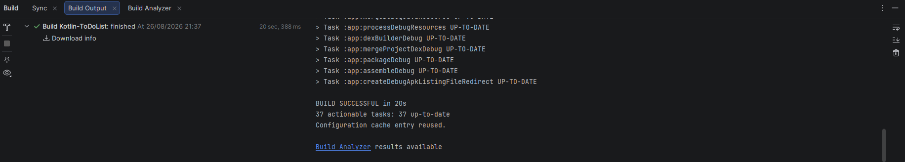
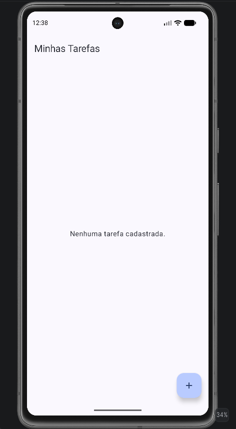
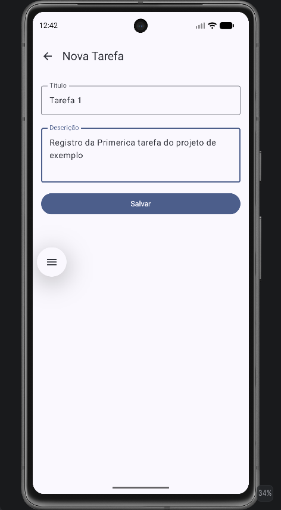
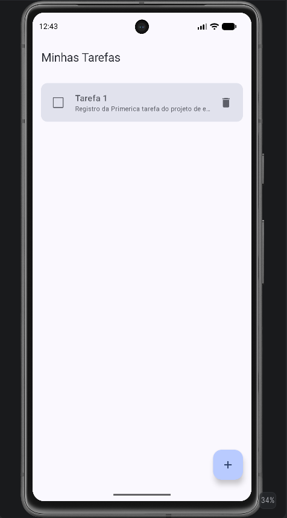
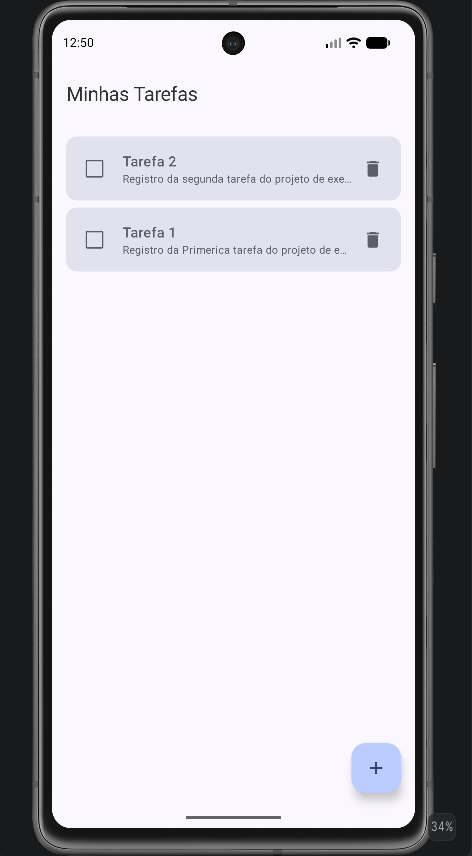
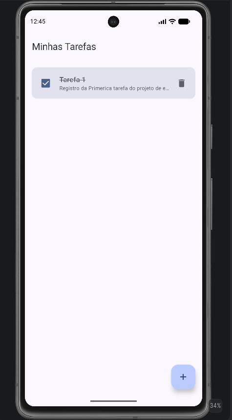
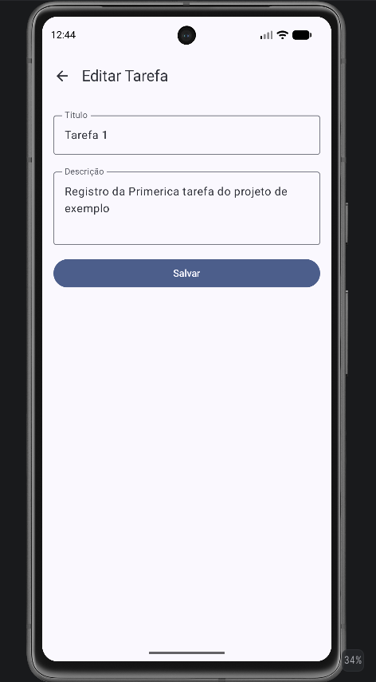
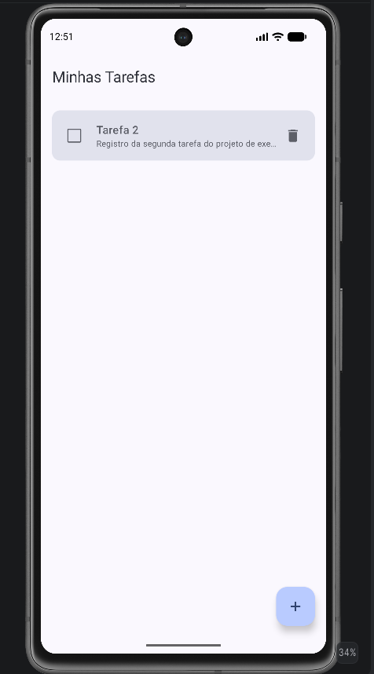

# ToDo List App

## Descrição do Projeto e Objetivo da Aplicação
Este é um aplicativo de Lista de Tarefas (ToDo List) desenvolvido para ajudar os usuários a organizarem suas atividades diárias. O objetivo da aplicação é permitir o cadastro, visualização, edição, exclusão e conclusão de tarefas de maneira simples e intuitiva, mantendo os dados salvos localmente no dispositivo.

## Tecnologias Utilizadas
* **Kotlin:** Linguagem de programação moderna e concisa utilizada no desenvolvimento Android.
* **Jetpack Compose:** Kit de ferramentas moderno do Android para a construção de interfaces de usuário (UI) nativas de forma declarativa.
* **Room:** Biblioteca de persistência que fornece uma camada de abstração sobre o SQLite para permitir acesso fluente ao banco de dados, aproveitando todo o poder do SQLite.
* **Coroutines/Flow:** Utilizados para lidar com a programação assíncrona, permitindo o fluxo reativo e contínuo de dados (como as atualizações na lista de tarefas vindo do banco de dados).
* **ViewModel:** Componente de arquitetura projetado para armazenar e gerenciar dados relacionados à UI, sobrevivendo a mudanças de configuração (como a rotação de tela).
* **Navigation Compose:** Componente de navegação projetado para funcionar perfeitamente com Jetpack Compose, permitindo a transição entre telas dentro do aplicativo.

## Arquitetura e Estrutura

### TarefaRepository
O `TarefaRepository` é responsável por abstrair a fonte de dados (neste caso, o banco de dados Room via DAO). Ele serve como a única fonte de verdade (Single Source of Truth) para os dados da aplicação. Ele fornece métodos limpos para a ViewModel acessar e manipular as tarefas (ex: inserir, atualizar, deletar, buscar todas e buscar por ID) sem que a ViewModel precise saber os detalhes de como o banco funciona por baixo dos panos.

### TarefaViewModel
A `TarefaViewModel` atua como a ponte entre o `TarefaRepository` e a interface de usuário (UI). Sua responsabilidade é expor os dados para a UI através de estados reativos (usando `StateFlow`) e processar as intenções/ações disparadas pela UI (como o clique no botão de salvar tarefa ou marcar como concluída). Ela utiliza Coroutines para realizar as chamadas assíncronas ao repositório para não bloquear a thread principal da UI.

### ListaTarefasScreen: Observação de Estado e Ações
A tela `ListaTarefasScreen` é a principal interface de interação do usuário. Seus pontos chave são:
* **Reatividade:** Ela observa continuamente o fluxo de dados exposto pela ViewModel (através de `collectAsState()`). Se uma tarefa é adicionada, removida ou alterada, a UI é recomposta automaticamente, garantindo que o usuário veja sempre o estado mais atual do banco de dados.
* **Delegação de Eventos:** Para garantir uma arquitetura limpa, a tela não possui lógica de negócio. Ações do usuário, como clicar no checkbox para concluir uma tarefa ou tocar no botão flutuante (FAB) para criar uma nova, disparam eventos (callbacks) que são processados exclusivamente pela ViewModel.
* **Componentização:** A lista utiliza componentes otimizados do Compose (como `LazyColumn`) para garantir uma exibição eficiente e uma rolagem suave, renderizando apenas os itens visíveis na tela.

### FormularioTarefaScreen: Diferenciação entre Cadastro e Edição
A `FormularioTarefaScreen` demonstra o poder da reutilização de componentes no Jetpack Compose, atendendo a dois propósitos através de uma única interface:
* **Modo de Cadastro:** Quando acessada pelo botão de nova tarefa, a tela é carregada sem um ID específico. A ViewModel inicializa os `TextFields` vazios. Ao salvar, uma nova entidade é criada e inserida no Room.
* **Modo de Edição:** Quando acessada a partir do clique em uma tarefa já existente, a navegação envia o ID correspondente. A tela repassa esse ID para a ViewModel, que busca os dados no banco e preenche automaticamente os campos de título e descrição. Ao salvar, a aplicação aciona a operação de atualização (`Update`) no Room em vez de criar um novo registro.
* **Controle de Estado Local:** A tela mantém estados para os inputs de texto, repassando as mudanças para a ViewModel ou lidando localmente antes de disparar a ação definitiva de salvamento.

### Rotas e AppNavigation: Passagem do ID da Tarefa
O `AppNavigation` centraliza todo o fluxo de navegação usando o `NavHost` do Compose, funcionando como um roteador para o aplicativo:
* **Mapeamento de Destinos:** Cada tela é associada a uma string de rota (ex: `"listaTarefas"` para a home).
* **Argumentos Dinâmicos:** A inteligência da navegação está na passagem de parâmetros. A rota do formulário é estruturada com um argumento acoplado: `"formularioTarefa/{tarefaId}"`.
* **Transição entre Telas:** Ao clicar em editar uma tarefa (ex: ID 5), a navegação aciona a rota `"formularioTarefa/5"`. O componente `composable` de destino extrai esse valor usando `navArguments` (convertendo para o tipo esperado, como Int) e o repassa como parâmetro para a tela do formulário, permitindo que a tela saiba exatamente qual tarefa deve ser carregada.

### MainActivity: Inicialização
A `MainActivity` atua como o ponto de entrada principal do aplicativo. Nela, o ciclo de vida da Activity é usado para instanciar a `TarefaViewModel` (geralmente por meio do `viewModels()` delegate com as factories correspondentes ou injeção de dependência). Em seguida, ela invoca a função composable de topo (como o `AppNavigation`), passando o ViewModel (ou deixando que a navegação o instancie) para iniciar a tela inicial da aplicação e o fluxo de navegação.

## Instruções Básicas para Execução
1. **Pré-requisitos:** Certifique-se de ter o Android Studio instalado.
2. **Abra o Projeto:** Abra a pasta raiz do projeto usando o Android Studio (`File > Open...`).
3. **Sincronização:** Aguarde o Android Studio realizar o processo de sync do Gradle e baixar as dependências do projeto.
4. **Execução:** Conecte um dispositivo físico Android ou inicie um Emulador via Device Manager.
5. **Rodar (Run):** Clique no botão verde de "Play" (Run 'app') na barra superior do Android Studio (ou use o atalho Shift+F10) para compilar e instalar a aplicação.

## Evidências
Abaixo estão as capturas de tela demonstrando o funcionamento do projeto:

- **Build do Projeto sem Erros:**
  

- **Tela Inicial Vazia:**
  

- **Tela de Cadastro de Nova Tarefa:**
  

- **Tela com 1 Tarefa na Lista:**
  

- **Tela Inicial com 2 Tarefas:**
  

- **Tela de Exibição de Tarefa Concluída:**
  

- **Tela de Edição de Tarefa Existente:**
  

- **Tela de Exclusão de Tarefa:**
  
